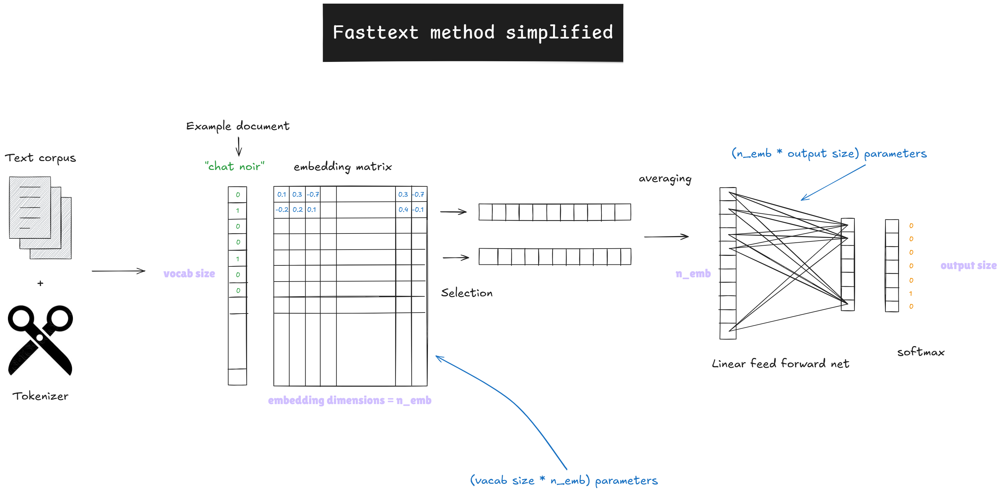
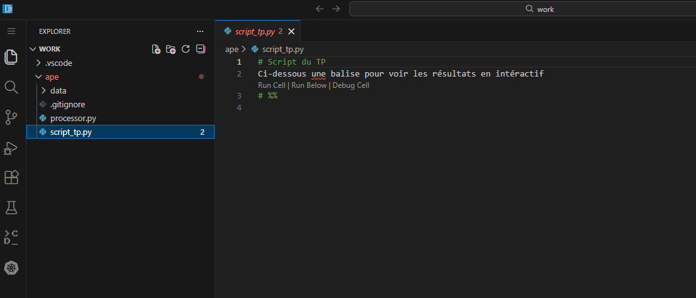

Cette application illustrera certains apports des outils du
NLP pour la codification automatique des déclarations d'activité
dans la nomenclature des activités françaises.
Vous pourrez réaliser ce TP dans un service préconfiguré du `SSP Cloud` en cliquant sur le lien ci-dessous :

<a href="https://datalab.sspcloud.fr/launcher/ide/vscode-pytorch?name=vscode-pytorch-nouvellessouces&version=2.4.5&s3=region-79669f20&init.personalInit=«https%3A%2F%2Fraw.githubusercontent.com%2FInseeFrLab%2Fcours-nouvelles-donnees-site%2Frefs%2Fheads%2Fmain%2Fapplications%2Fapp2-init.sh»&autoLaunch=true" target="_blank" rel="noopener"></a>


Ce tutoriel n'a pas vocation à introduire aux principaux concepts du NLP (tokenisation, sac de mot, _embedding_, etc.) mais à être une introduction pratique à la thématique de la classification textuelle. Pour découvrir les concepts centraux du NLP, se référer au cours de [`Python` pour la _data science_](https://pythonds.linogaliana.fr/content/NLP/) de l'ENSAE.


## Objectifs

Ce tutoriel se propose d'illustrer la problématique de la classification automatique en mobilisant un algorithme d'apprentissage supervisé de type `FastText`, à partir des données issues des déclarations Sirene.

L'idée de ce tutoriel est de classer des déclarations d'entreprises dans une nomenclature générique des activités productives. Celle-ci permet de produire de nombreuses statistiques économiques sectorielles sur le tissu productif français.

L'Insee ayant vocation à produire des statistiques agrégées sur de nombreuses questions, cette approche constitue l'un des principaux cas d'application du NLP pour l'Institut dans des domaines aussi divers que la classification dans une nomenclature d'activités (NAF), une nomenclature de professions (PCS), de produits (COICOP), de lieux géographiques, etc.

Comment passe-t-on d'une déclaration en langage naturel, qui fait sens pour un entrepreneur, à une représentation plus générique, et forcément plus simpliste, de l'activité d'une entreprise, qui fait sens à une institution statistique et espérons, pour le débat public ? Grâce à des algorithmes de classement _ad hoc_ qui permettent d'extraire une information à partir de libellés textuels. Historiquement l'Insee utilisait des règles déterministes de classement à partir d'un algorithme nommé [Sicore](https://www.insee.fr/fr/information/4497076?sommaire=4497095), une IA symbolique qui classait à partir de règles métiers préconfigurée.

Avec l'avènement du _machine learning_, la possibilité d'entraîner un algorithme apprenant par induction plutôt que de manière déductive, est apparue être une voie d'investissement intéressante pour l'Insee. L'objet de ce TD est d'illustrer la démarche adoptée avec cette approche à partir d'un modèle un peu plus simple que celui mis en oeuvre à l'Insee mais reprenant les principales caractéristiques de celui-ci.

Voici un schéma simplifié pour comprendre l'architecture de notre modèle (très proche de Fasttext) :

{.lightbox}

## Environnement de travail

Le services VSCode préconfiguré contient :

- les données dans un dossier "data"
- un module de preprocessing
- un script `script_tp.py` vierge où écrire votre code (la puce `# %%` permet une utilisation intéractive à l'instar des notebooks Jupyter).



## Exploration du jeu de données

Le code pour lire les données est directement fourni :

```{python}
#| echo: true
#| label: download-data

import os
import pandas as pd

# Import NAF classification
naf = pd.read_excel("data/naf.xls", skiprows = 2)

# Import training data
train = pd.read_parquet("data/data.parquet")

# Merge classification info
naf['Code'] = naf['Code'].str.replace(".","")
train = train.merge(naf, left_on = "nace", right_on = "Code")
train.head(5)

```


Le premier exercice a vocation à illustrer la manière classique « d'entrer » dans un corpus de données textuelles.

La démarche n'est pas particulièrement originale mais permet d'illustrer les enjeux du nettoyage de texte.


### Questions
0. Lancer le code ci-dessous pour préparer votre environnement de travail :

```{.python}
# Charge la bibliothèque spaCy pour le traitement du langage naturel (NLP)
import spacy

# Télécharge le modèle français pour spaCy (nécessaire pour l'analyse morphosyntaxique en français)
os.system("python -m spacy download fr_core_news_sm")

# Charge la bibliothèque NLTK pour le traitement du texte
import nltk

# Télécharge le tokeniseur "punkt_tab" de NLTK (pour la segmentation en phrases/tokens)
nltk.download('punkt_tab')

# Télécharge la liste des stopwords français/anglais de NLTK (mots vides comme "le", "la", "the", etc.)
nltk.download('stopwords')

```

1. Créer une fonction `filter_train_data` qui filtre les lignes du df dont le libellé d'activité __contient__ un pattern (mot) donné.
Cette fonction aussi doit afficher (print) le nombre de lignes concernées.
Tester avec _"data science"_ et _"boulanger"_.

::: {.callout-tip}
Pensez à l'impact de la capitalisation du texte dans vos résultats. Vous avez un indice plus bas pour le résultat à trouver.
:::

2. Faire une fonction `graph_wordcloud` pour afficher le _wordcloud_ de notre corpus dans son ensemble et de certaines
catégories de la nomenclature pour comprendre la nature de notre corpus.


<details>
<summary>
Aide
</summary>

```{.python}
import matplotlib.pyplot as plt
from wordcloud import WordCloud

all_text = ["boulanger", "chauffer", "bus"]

wordcloud = WordCloud(
    width=800,
    height=500,
    random_state=21,
    max_words=2000,
    background_color="white",
    colormap='Set2'
).generate(all_text)

```

</details>


3. Retirer les stopwords à partir de la liste des mots disponibles dans [`SpaCy`](https://spacy.io/models).

::: {.callout-tip}
La fonction `word_tokenize` du package `nltk` peut vous être utile. Allez voir la [documentation](https://www.nltk.org/api/nltk.tokenize.word_tokenize.html).
:::

<details>
<summary>
Aide
</summary>

```{.python}
import spacy
from nltk.tokenize import word_tokenize

nlp = spacy.load("fr_core_news_sm")
stop_words = nlp.Defaults.stop_words
stop_words = set(stop_words)

# Function to remove stopwords
def remove_stopwords(text):
    word_tokens = word_tokenize(text)
    filtered_text = ...
    return ' '.join(filtered_text)

def remove_single_letters(text):
    word_tokens = word_tokenize(text)
    filtered_text = ...
    return ' '.join(filtered_text)

# Apply the function to the 'text' column
train['text_clean'] = (train['text']
    .apply(remove_stopwords)
    .apply(remove_single_letters)
)
```

</details>


4. Refaire quelques uns des nuages de mots et étudier la différence avant nettoyage.


### Éléments de réponse

1. Dans une démarche exploratoire, le plus simple est de commencer par compter les mots de manière indépendante (approche sac de mot).
Par exemple, de manière naturelle, nous avons beaucoup plus de déclarations liées à la boulangerie que liées à la _data science_:

```{python}
#| label: filter_train_data
train_data=train.copy()

def filter_train_data(train_data, sequence):
    sequence_capitalized = sequence.upper()
    mask = train_data['text'].str.contains(sequence_capitalized)
    nb_occurrence = mask.astype(int).sum()
    print(
        f"Nombre d'occurrences de la séquence '{sequence}': {nb_occurrence}"
    )
    return train_data.loc[mask]
```

```{python}
#| label: use-filter_train_data
#| echo: true
filter_train_data(train, "data science").head(5)
```
```{python}
#| label: use-filter_train_data2
#| echo: true
filter_train_data(train, "boulanger").head(5)
```

2. Voici les nuages de mots obtenus à partir des données.

```{python}
#| label: def-graph_wordcloud
import matplotlib.pyplot as plt
from wordcloud import WordCloud

def graph_wordcloud(train_data, text_var="text", naf=None):
    if naf is not None:
        train_data = train_data.loc[train_data['nace'] == naf]

    txt = train_data[text_var]
    all_text = ' '.join([text for text in txt])
    wordcloud = WordCloud(
        width=800,
        height=500,
        random_state=21,
        max_words=2000,
        background_color="white",
        colormap='Set2'
    ).generate(all_text)
    return wordcloud
```

Les _wordclouds_ peuvent servir à rapidement visualiser la structure d'un corpus.
On voit ici que notre corpus est très bruité car nous n'avons pas nettoyé celui-ci:

```{python}
#| label: use-graph_wordcloud
wordcloud_corpus = graph_wordcloud(train.sample(10000))
plt.imshow(wordcloud_corpus, interpolation="bilinear")
```

Pour commencer à se faire une idée sur les spécificités des catégories, on peut représenter le corpus de certaines d'entre elles ?
Arrivez-vous à inférer la catégorie de la NAF en question ? Si oui, vous utilisez sans doute des heuristiques
proches de celles que nous allons mettre en oeuvre dans notre algorithme de classification.

```{python}
#| label: use-graph_wordcloud2
wordcloud_corpus = graph_wordcloud(train, naf = "1071C")
plt.imshow(wordcloud_corpus, interpolation="bilinear")
```

```{python}
#| label: use-graph_wordcloud3
wordcloud_corpus = graph_wordcloud(train, naf = "4942Z")
plt.imshow(wordcloud_corpus, interpolation="bilinear")
```

3. Néanmoins, à ce stade, les données sont encore très bruitées.
La première étape classique est de retirer les _stop words_ et éventuellement des termes spécifiques à notre corpus.
Par exemple, pour des données de caisse, on retirera les bruits, les abréviations, etc. qui peuvent bruiter notre corpus.

```{python}
#| label: data-cleaning
from nltk.tokenize import word_tokenize
import spacy

nlp = spacy.load("fr_core_news_sm")
stop_words = nlp.Defaults.stop_words
stop_words = set(stop_words)

# Function to remove stopwords
def remove_stopwords(text):
    word_tokens = word_tokenize(text)
    filtered_text = [word for word in word_tokens if word.lower() not in stop_words]
    return ' '.join(filtered_text)

def remove_single_letters(text):
    word_tokens = word_tokenize(text)
    filtered_text = [word for word in word_tokens if len(word) > 1]
    return ' '.join(filtered_text)

# Apply the function to the 'text' column
train['text_clean'] = (train['text']
    .apply(remove_stopwords)
    .apply(remove_single_letters)
)
```

4. Voici le wordcloud de notre corpus tout entier une fois cette première étape de nettoyage achevée :

```{python}
#| label: use-graph_wordcloud4
wordcloud_corpus_cleaned = graph_wordcloud(train.sample(10000), "text_clean")
plt.imshow(wordcloud_corpus_cleaned, interpolation="bilinear")
```


## Premier algorithme d'apprentissage supervisé

Nous avons nettoyé nos données. Cela devrait améliorer la pertinence de nos modèles en réduisant le ratio signal/bruit.
Nous allons généraliser notre nettoyage de texte en appliquant un peu plus d'étapes que précédemment. Nous allons
notamment _raciniser_ nos mots : cela veut dire qu'on ne va transformer les mots pour ne garder que leur racine.
`'MISSIONS PONCTUELLES AIDE PLATEFORME` sera remplacé par les racines des mots `'mission ponctuel aid plateform'`.

Pour cela, il suffit de charger le module `processor.py` mis à disposition dans votre environnement de travail.
Le code de nettoyage est directement fourni:

```{python}
#| label: data-processessing
#| echo: true

from processor import Preprocessor
preprocessor = Preprocessor()

# Preprocess data before training and testing
TEXT_FEATURE = "text"
Y = "nace"

df = train.copy()

df = preprocessor.clean_text(df, TEXT_FEATURE).drop('text_clean', axis = "columns")
df.head(2)
```

::: {.callout-tip}
Pour développer votre code, utilisez un échantillon des données pour éviter les temps de calculs trop long au début.
:::

Récupérons les features et les labels.

```{python}
#| label: get-features
#| echo: true

df = df.dropna(subset = [Y, TEXT_FEATURE])
X = df[TEXT_FEATURE].values
y = df[Y].values
```


1. Encoder les labels et découper les données en _train_, _val_ et _test_.

<details>
<summary>
Aide
</summary>

```{.python}
# Pour l'encoding :
from sklearn.preprocessing import LabelEncoder

# Pour le split :
from sklearn.model_selection import train_test_split

```
</details>

Nous allons utiliser `torchTextClassifiers (ttc)` pour entraîner notre modèle.
`ttc` est un framework de codification automatique, construit sur `torch` et qui permet de d'entraîner des modèles de codification automatique.
`ttc` va ici nous permettre d'entraîner un modèle de type `Fasttext`, mais sans passer par la vieille librairie archivée par Meta.
À noter que `ttc` est une librairie _opensource_, développée et maintenue par l'Insee (unité SSPLab).

La première étape consiste à instancier un tokenizer.
Nous allons utiliser ici le tokenizer basique de la méthodologie `Fasttext` (découpage en mots, ngrams de mots et ngrams de caractères).

2. Instancier un tokenizer `NGramTokenizer` (essayer à partir de la documentation de `torchTextClassifiers` - ou en reprenant le code ci-dessous pour les moins courageux)

<details>
<summary>
Aide
</summary>

```{.python}
from torchTextClassifiers.tokenizers.ngram import NGramTokenizer

tokenizer = NGramTokenizer(
    min_count=2, # On considère un mot s'il est trouvé au moins 2 fois dans le corpus
    min_n=2,
    max_n=4, # On fait des 2grams, 3grams et 4grams de caractères
    len_word_ngrams=2, # On fait des 2grams de mots
    num_tokens=10000, # Nombre max de tokens considérés dans le vocable
    training_text=X, # Jeu d'entraînement du tokenizer
)
```
</details>


3. Etudiez le code dans l'aide ci-dessous et lancez-le. Malheureusement, l'entraînement d'un bon modèle prend du temps et de la ressource (GPU) : ici, nous vous donnons le code pour faire toutes les étapes vous-même mais, au lieu de faire l'entraînement (code en commentaire), nous vous proposons de télécharger un modèle déjà entraîné par nos soins (avec les mêmes données et les mêmes configurations que celles du TP).


<details>
<summary>
Aide
</summary>

```{.python}

# Set model configs ---------------

from torchTextClassifiers import ModelConfig
import numpy as np

# Embedding dimension
embedding_dim = 64

# Count number of unique labels
unique_values, counts = np.unique(y, return_counts=True)
num_unique = len(unique_values)

model_config = ModelConfig(
    embedding_dim=embedding_dim,
    num_classes=num_unique
)

# Instanciate a ttc model (nammed "classifier") ---------------

from torchTextClassifiers import torchTextClassifiers

classifier = torchTextClassifiers(
    tokenizer=tokenizer,
    model_config=model_config
)

# Set the training configs ---------------

from torchTextClassifiers import TrainingConfig

# Training params (torch style)
training_config = TrainingConfig(
    num_epochs=30,
    batch_size=8,
    lr=1e-3,
    patience_early_stopping=7,
    num_workers=0,
    trainer_params={'deterministic': True}
)

# Training (too long) !

# classifier.train(
#     X_train,
#     y_train,
#     training_config,
#     X_val,
#     y_val,
#     verbose=True
# )

# Download a pre-trained instead to make it faster :

# Download the model
base_url = "https://minio.lab.sspcloud.fr/projet-formation/nouvelles-sources/model_ape"
files = ["metadata.pkl", "model_checkpoint.ckpt", "tokenizer.pkl"]

for file in files:
    os.system(f"curl {base_url}/{file} --output data/model_ape/{file} --create-dirs")

# Load it
classifier = torchTextClassifiers.load("model_ape")

```
</details>

4. Calculer l'accuracy du modèle.

5. Tester le modèle sur quelques libellés de professions :

```{.python}
searched_professions = np.array(["Conseil datascience", "Concésion dans l'automobile", "Concession automobile", "peintre"])
```


```{python}
#| label: label-encoding
from sklearn.preprocessing import LabelEncoder
le = LabelEncoder()
y_encoded = le.fit_transform(y)  # Convertit ["cat", "dog"] → [0, 1]
```


```{python}
#| label: split-data

# Première division : train (80 %) + test (20%)
from sklearn.model_selection import train_test_split

X_train, X_test, y_train, y_test = train_test_split(
    X,
    y_encoded,
    test_size=0.2,
    random_state=0,
    shuffle=True,
)
# Deuxième division pour aboutir à : train (60 % = 80% * 75%) + val =  (60 % = 80% * 25%) + test (20%)

X_train, X_val, y_train, y_val = train_test_split(
    X_train,
    y_train,
    test_size=0.25,
    random_state=0,
    shuffle=True,
)
```


```{python}
#| label: useless-chunk

# from torchTextClassifiers.tokenizers.ngram import NGramTokenizer

# tokenizer = NGramTokenizer(
#     min_count=2, # On considère un mot s'il est trouvé au moins 2 fois dans le corpus
#     min_n=2,
#     max_n=4, # On fait des 2grams, 3grams et 4grams de caractères
#     len_word_ngrams=2, # On fait des 2grams de mots
#     num_tokens=10000, # Nombre max de tokens considérés dans le vocable
#     training_text=X, # Jeu d'entraînement du tokenizer
# )

# # Set model configs ---------------

# from torchTextClassifiers import ModelConfig
# import numpy as np

# # Embedding dimension
# embedding_dim = 64

# # Count number of unique labels
# unique_values, counts = np.unique(y, return_counts=True)
# num_unique = len(unique_values)

# model_config = ModelConfig(
#     embedding_dim=embedding_dim,
#     num_classes=num_unique
# )

# # Instanciate a ttc model (nammed "classifier") ---------------

# from torchTextClassifiers import torchTextClassifiers

# classifier = torchTextClassifiers(
#     tokenizer=tokenizer,
#     model_config=model_config
# )

# # Set the training configs ---------------

# from torchTextClassifiers import TrainingConfig

# # Training params (torch style)
# training_config = TrainingConfig(
#     num_epochs=30,
#     batch_size=8,
#     lr=1e-3,
#     patience_early_stopping=7,
#     num_workers=0,
#     trainer_params={'deterministic': True}
# )

```

Chargement du modèle :

```{python}
#| label: load-model
from torchTextClassifiers import torchTextClassifiers as ttc
classifier = ttc.load("model_ape")
```

Evaluation du modèle :

```{python }
#| label: get-accuracy

# Force single-threaded execution (for gh actions)
import torch.multiprocessing as mp
mp.set_start_method("spawn", force=True)
import torch
import os
torch.set_num_threads(1)
torch.set_num_interop_threads(1)
os.environ["OMP_NUM_THREADS"] = "1"
os.environ["MKL_NUM_THREADS"] = "1"

import numpy as np
n = X_test.shape[0]
sample_size = min(1000, n)

rng = np.random.default_rng(seed=42)
idx = rng.choice(n, size=sample_size, replace=False)

X_sample = X_test[idx]
y_sample = y_test[idx]

# Inference on testset
result = classifier.predict(X_sample)

```

```{python }
#| label: get-accuracy2
predictions = result["prediction"].squeeze().numpy()
```

```{python }
#| label: get-accuracy3

# Step 8: Evaluate
accuracy = (predictions == y_sample).mean()
print(f"Test accuracy: {accuracy:.3f}")

```

Testons le modèle sur quelques libellés d'activité :

```{python}
#| label: test-inference
import numpy as np

searched_professions = np.array(["Conseil datascience", "Concésion dans l'automobile", "Concession automobile", "peintre"])
preds = classifier.predict(searched_professions)

for profession, prediction, confidence in zip(searched_professions, preds["prediction"], preds["confidence"]):
    # Affichage de la profession recherchée
    print(f"\n🔍 Profession recherchée : {profession}")

    # Conversion sécurisée de la prédiction (compatible PyTorch/NumPy)
    pred_code = prediction.cpu().numpy()
    pred_labels = le.inverse_transform(pred_code)

    # Récupération des libellés NAF correspondants
    matching_labels = naf.loc[naf["Code"].isin(pred_labels), "Libellé"].tolist()

    # Affichage des résultats
    print(f"🏷️ Profession(s) trouvée(s) : {', '.join(matching_labels)}")
    print(f"📊 Confiance : {confidence.item() if hasattr(confidence, 'item') else confidence:.2f}")


```


## Pour aller plus loin, introduction au MLOps

On utilise dans cette application un modèle de Machine
Learning (ML) pour prédire l'activité des entreprises à
partir de texte descriptifs. Les méthodes de
ML sont quasiment indispensables pour traiter du texte,
mais utiliser des modèles de ML pour servir des cas d'usage
réels demande de respecter un certain nombre de bonnes pratiques
pour que tout se passe convenablement, en particulier:

- Tracking propre des expérimentations
- Versioning des modèles, en même temps que des données et du code correspondants
- Mise à disposition efficace du modèle aux utilisateurs
- Monitoring de l'activité du modèle servi
- Réentraînement du modèle

Une introduction à ces bonnes pratiques, auxquelles on fait
régulièrement référence à travers le terme MLOps, est donné dans
[cette formation](https://inseefrlab.github.io/formation-mlops/slides/fr/index.html#/title-slide)
([dépôt associé](https://github.com/InseeFrLab/formation-mlops)).
